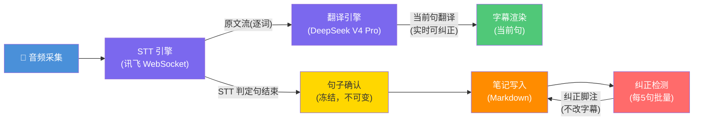
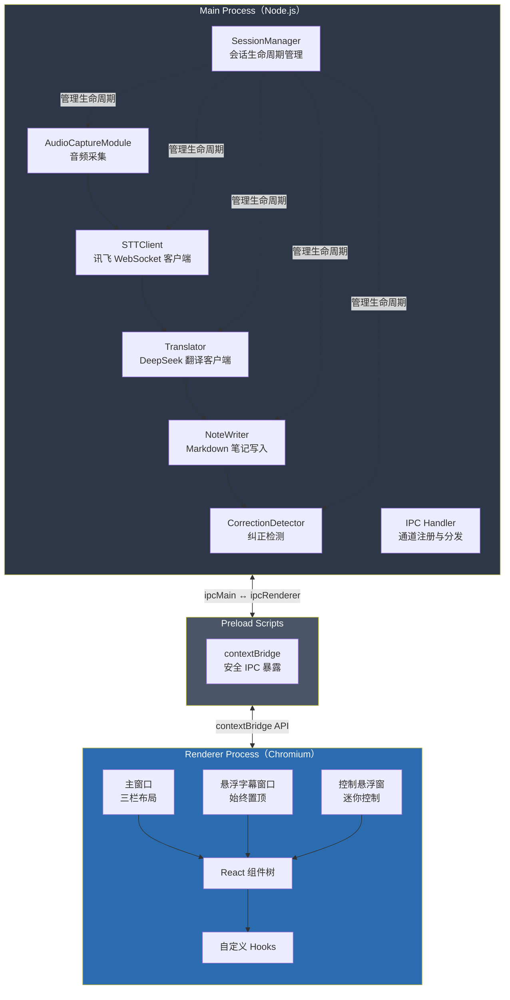
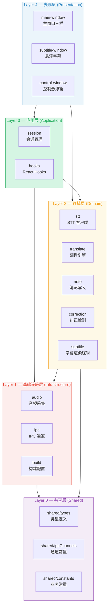
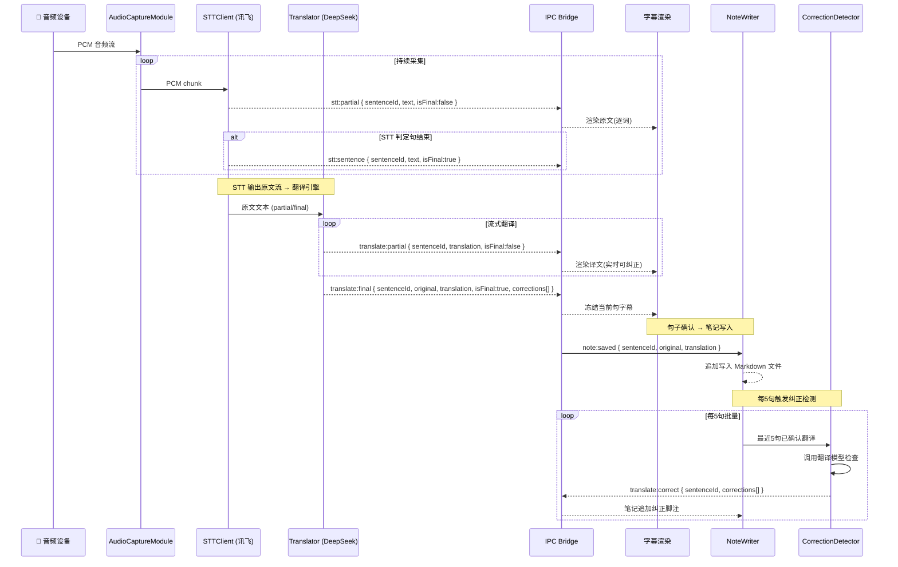

# SynchroLens 架构蓝图

> SynchroLens — AI 同声传译助手
> 技术栈: Electron + React + TypeScript + TailwindCSS + Vite

---

## 1. 系统架构图（管道式）

SynchroLens 采用管道式架构，数据在各阶段单向流动，每个阶段职责单一、可独立替换。



**管道阶段说明：**

| 阶段 | 职责 | 输入 | 输出 | 可替换性 |
|------|------|------|------|----------|
| 音频采集 | 从系统音频/麦克风采集 PCM 数据 | 系统音频设备 | PCM 音频流 | 可换采集库 |
| STT 引擎 | 实时语音转写，逐词输出 | PCM 音频流 | `STTResult`（partial/final） | 可换 STT 服务商 |
| 翻译引擎 | 流式翻译，实时可纠正 | 原文文本 | `TranslationResult`（partial/final） | 可换翻译模型 |
| 字幕渲染 | 当前句实时显示 | `TranslationResult` | 屏幕字幕 | — |
| 句子确认 | STT 判定句结束后冻结 | `STTResult.isFinal` | 不可变句子 | — |
| 笔记写入 | 将确认句写入 Markdown | 冻结句子 | `.md` 文件 | 可换存储格式 |
| 纠正检测 | 每5句批量检查历史翻译 | 已确认句子列表 | `Correction[]` 脚注 | 可换检测策略 |

---

## 2. 进程架构（Main / Renderer / Preload）

Electron 三进程模型，严格隔离职责，通过 IPC 通信。



**进程职责：**

| 进程 | 运行环境 | 职责 | 关键模块 |
|------|----------|------|----------|
| Main | Node.js | 音频采集、STT/翻译 API 调用、笔记写入、会话管理 | AudioCaptureModule, STTClient, Translator, NoteWriter, CorrectionDetector, SessionManager |
| Renderer | Chromium | UI 渲染、用户交互、字幕显示 | 主窗口、悬浮字幕窗口、控制悬浮窗 |
| Preload | 隔离环境 | 安全桥接，暴露受限 IPC API | contextBridge |

---

## 3. 模块依赖拓扑（Layer 分层）

依赖方向：上层可依赖下层，下层不可依赖上层。同层模块间通过事件/接口解耦。



**模块与目录对应关系：**

| 模块 Scope | Layer | 目录路径 | 职责 |
|------------|-------|----------|------|
| `audio` | L1 基础设施 | `src/main/modules/audio/` | 系统音频/麦克风 PCM 采集 |
| `stt` | L2 领域 | `src/main/modules/stt/` | 讯飞 WebSocket 实时转写 |
| `translate` | L2 领域 | `src/main/modules/translate/` | DeepSeek V4 Pro 流式翻译 |
| `note` | L2 领域 | `src/main/modules/note/` | Markdown 笔记写入 |
| `correction` | L2 领域 | `src/main/modules/correction/` | 翻译纠正检测 |
| `session` | L3 应用 | `src/main/modules/session/` | 会话生命周期管理 |
| `subtitle` | L2 领域 | `src/renderer/windows/subtitle/` | 悬浮字幕渲染逻辑 |
| `control` | L4 表现 | `src/renderer/windows/control/` | 迷你控制悬浮窗 |
| `main` | L4 表现 | `src/renderer/windows/main/` | 主窗口三栏布局 |
| `ipc` | L1 基础设施 | `src/main/ipc/` | IPC 通道注册与分发 |
| `shared` | L0 共享 | `src/shared/` | 类型、通道常量、业务常量 |
| `preload` | L1 基础设施 | `src/preload/` | contextBridge 安全暴露 |
| `build` | L1 基础设施 | 项目根目录 | Electron Builder / Vite 配置 |

**依赖规则：**

- **L0 → 无依赖**：纯类型和常量，被所有层引用
- **L1 → L0**：基础设施只依赖共享定义
- **L2 → L0, L1**：领域模块通过 IPC 通信，不直接依赖其他领域模块
- **L3 → L0, L1, L2**：应用层编排领域模块
- **L4 → L0, L2, L3**：表现层消费领域数据和应用服务

---

## 4. 数据流图（完整管道）

覆盖从音频采集到纠正检测的完整数据流，标注关键数据结构和流转节点。



**数据流关键节点：**

| 节点 | 数据结构 | 说明 |
|------|----------|------|
| STT 输出 | `STTResult { sentenceId, text, isFinal, timestamp }` | `isFinal=false` 为逐词 partial，`isFinal=true` 为句结束 |
| 翻译输出 | `TranslationResult { sentenceId, original, translation, isFinal, corrections[] }` | partial 阶段实时可纠正，final 后冻结 |
| 纠正结果 | `Correction { from, to, reason, timestamp }` | 仅写入笔记脚注，不回改字幕 |
| 笔记写入 | Markdown 文本 | 追加模式写入，每句一段 |
| 会话数据 | `Session { id, startTime, endTime?, audioSource, sentences[], notePath?, summary? }` | 完整会话生命周期数据 |

---

## 5. IPC 通信协议

### 5.1 通道清单

#### Main → Renderer（主进程推送）

| 通道名 | 载荷类型 | 触发时机 |
|--------|----------|----------|
| `stt:partial` | `{ sentenceId, text, isFinal: false, timestamp }` | STT 逐词识别 |
| `stt:sentence` | `{ sentenceId, text, isFinal: true, timestamp }` | STT 判定句结束 |
| `translate:partial` | `{ sentenceId, translation }` | 翻译流式输出 |
| `translate:final` | `{ sentenceId, original, translation, isFinal: true, corrections[] }` | 翻译完成 |
| `translate:correct` | `{ sentenceId, oldTranslation, newTranslation, reason }` | 纠正检测完成 |
| `note:saved` | `{ filePath }` | 笔记写入完成 |
| `note:summary` | `{ summary }` | 摘要生成完成 |
| `session:state-change` | `{ state: 'idle'\|'running'\|'paused'\|'stopped' }` | 会话状态变更 |

#### Renderer → Main（渲染进程请求）

| 通道名 | 载荷 | 用途 |
|--------|------|------|
| `session:start` | `{ audioSource }` | 启动会话 |
| `session:stop` | — | 停止会话 |
| `session:pause` | — | 暂停会话 |
| `session:resume` | — | 恢复会话 |
| `config:update` | `Record<string, unknown>` | 更新配置 |
| `summary:trigger` | — | 触发摘要 |
| `window:prepare-record` | — | 创建字幕窗+控制窗+最小化主窗 |
| `window:exit-control` | `{ action: 'minimize'\|'stop' }` | 隐藏/关闭控制窗 |
| `window:toggle-subtitle` | `{ visible: boolean }` | 字幕窗 show/hide |
| `favorite:get` | — | 获取所有收藏 |
| `favorite:add` | `{ text, noteFileName, noteFilePath }` | 添加收藏 |
| `favorite:remove` | `{ id }` | 删除收藏 |
| `favorite:remove-batch` | `{ ids[] }` | 批量删除 |
| `favorite:search` | `{ query }` | 搜索收藏 |
| `favorite:export` | `{ ids[], savePath }` | 导出收藏 |
| `improve:submit` | `{ original, improved, reason, context }` | 提交改进翻译 |
| `personal-dict:status` | — | 查询个人词典开关状态 |
| `dictionary:entries:get` | `{ dictType }` | 获取词典条目 |
| `dictionary:entry:remove` | `{ dictType, entryId }` | 删除词典条目 |
| `dictionary:file:load` | `{ dictType, filePath }` | 加载词典文件 |
| `dictionary:file:remove` | `{ dictType, filePath }` | 移除词典文件 |
| `dictionary:file:toggle` | `{ dictType, filePath, enabled }` | 启用/禁用词典文件 |
| `notes:list` | `{ dirPath? }` | 获取笔记文件树 |
| `notes:read` | `{ filePath }` | 读取笔记内容 |
| `notes:export-all` | `{ savePath }` | 导出全部笔记为 .zip |
| `data:clear` | `{ types[] }` | 清除历史数据 |
| `log:send` | `{ level, module, message, data? }` | 渲染进程日志上报 |

> 完整通道定义见 `src/shared/ipcChannels.ts`，接口契约见 `docs/API.md`

### 5.2 Preload 暴露 API

```typescript
// src/preload/index.ts — contextBridge 暴露结构
interface SynchroLensAPI {
  // 事件监听
  on(channel: string, callback: (data: unknown) => void): () => void;
  off(channel: string, callback: (data: unknown) => void): void;
  once(channel: string, callback: (data: unknown) => void): void;

  // 会话控制
  startSession(audioSource: 'system' | 'microphone'): Promise<void>;
  stopSession(): Promise<void>;
  pauseSession(): Promise<void>;
  resumeSession(): Promise<void>;
  updateConfig(config: Record<string, unknown>): Promise<void>;
  triggerSummary(): Promise<void>;

  // 窗口控制
  prepareRecord(): Promise<void>;
  exitControl(action: 'minimize' | 'stop'): Promise<void>;
  toggleSubtitle(visible: boolean): Promise<void>;

  // 收藏
  addFavorite(text: string, noteFileName: string, noteFilePath: string): Promise<void>;
  removeFavorite(id: string): Promise<void>;
  removeFavorites(ids: string[]): Promise<void>;
  getFavorites(): Promise<Favorite[]>;
  searchFavorites(query: string): Promise<Favorite[]>;
  exportFavorites(ids: string[], savePath: string): Promise<void>;

  // 改进与词典
  submitImprovement(original: string, improved: string, reason: string, context: string): Promise<void>;
  isPersonalDictEnabled(): Promise<boolean>;
  getDictionaryEntries(dictType: string): Promise<DictEntry[]>;
  removeDictionaryEntry(dictType: string, entryId: string): Promise<void>;
  loadDictionaryFile(dictType: string, filePath: string): Promise<void>;
  removeDictionaryFile(dictType: string, filePath: string): Promise<void>;

  // 笔记与数据
  listNotes(dirPath?: string): Promise<NoteTreeItem[]>;
  readNote(filePath: string): Promise<string>;
  exportAllNotes(savePath: string): Promise<void>;
  clearData(types: ('notes' | 'favorites' | 'personalDict')[]): Promise<void>;

  // 日志
  log(level: LogLevel, module: string, message: string, data?: unknown): void;
}
```

---

## 6. 关键设计决策

### 6.1 管道式架构选择

**决策**：采用管道式（Pipeline）架构而非事件总线或 MVC。

**理由**：
- **数据流向清晰**：音频 → STT → 翻译 → 字幕 → 笔记 → 纠正，天然单向流动，便于理解和调试
- **阶段可替换**：STT 引擎可从讯飞切换到 Whisper，翻译引擎可从 DeepSeek 切换到 GPT，只需实现相同接口
- **背压控制**：管道天然支持背压——翻译速度跟不上 STT 时，可缓冲或丢弃 partial 结果
- **延迟可控**：每个阶段的延迟可独立测量和优化，便于满足 `<3s` 端到端延迟要求

**权衡**：
- 阶段间耦合通过接口定义解耦，但管道顺序固定，动态重排困难
- 纠正检测是唯一的"回溯"流（需要回看历史句子），通过定时批量而非实时来避免打破管道单向性

### 6.2 上下文窗口策略

**决策**：翻译引擎维护滑动上下文窗口，保留最近 N 句原文作为翻译上下文。

**理由**：
- 同声传译场景下，前后句语义关联紧密（如代词指代、术语一致性）
- 滑动窗口避免上下文无限增长导致 API 延迟和费用上升
- N 值可配置，默认 5 句，在延迟和翻译质量间取得平衡

**实现要点**：
- 每次翻译请求携带最近 N 句已确认原文
- partial 翻译不携带上下文（优先延迟），final 翻译携带上下文（优先质量）
- 上下文窗口大小通过 `config:update` 通道运行时调整

### 6.3 纠正策略

**决策**：纠正检测采用"脚注式"策略——纠正结果仅追加到笔记，不回改已显示的字幕。

**理由**：
- **字幕稳定性**：用户已看到的字幕突然改变会造成困惑，破坏阅读连贯性
- **审计追溯**：保留原始翻译 + 纠正脚注，用户可自行判断采用哪个版本
- **性能考虑**：实时纠正需要重新翻译整句，延迟不可控；批量纠正（每5句）可利用空闲时间

**纠正流程**：
1. CorrectionDetector 每5句触发一次批量检查
2. 调用翻译模型对历史翻译进行复核
3. 发现纠正后通过 `translate:correct` 通道发送
4. NoteWriter 在笔记中追加纠正脚注：`> [纠正] 原译"XXX" → 修正为"YYY"（原因：...）`
5. 字幕不做任何修改

### 6.4 三窗口架构

**决策**：使用三个独立 BrowserWindow——主窗口、悬浮字幕窗口、控制悬浮窗。

**理由**：
- **悬浮字幕**：始终置顶、透明背景、鼠标穿透，不遮挡演讲内容，独立窗口确保置顶行为可靠
- **控制悬浮窗**：极简控制条（开始/停止 + 字幕开关 + 最小化 + 退出确认），类似录屏软件风格
- **主窗口**：三栏布局（侧边导航 + 内容区 + 摘要面板），SplashScreen 启动画面

**实现要点**：
- 字幕窗：`alwaysOnTop: true`, `transparent: true`, `frame: false`, `skipTaskbar: true`，800×120
- 控制窗：`alwaysOnTop: true`, 固定 320×48，不可调整大小，右上角初始位置
- 主窗口：1200×800，由 electron-vite 多页面构建驱动三窗口 HTML 入口
- 系统托盘：应用启动时创建，右键菜单"显示控制窗"（恢复被最小化的控制窗）/ "退出 SynchroLens"
- 控制窗 X 退出：弹窗三选 — 最小化到托盘 / 关闭控制窗口(停止录制) / 取消

### 6.5 音频采集方案

**决策**：优先使用系统音频回环采集（loopback），回退到麦克风采集。

**理由**：
- 同声传译场景下，用户通常在观看在线会议/演讲，需要翻译的是系统播放的音频
- 系统音频回环避免环境噪音干扰
- 回退麦克风保证在系统音频不可用时的基本功能

**实现要点**：
- Windows: 使用 WASAPI loopback 模式
- macOS: 需要安装虚拟音频驱动（如 BlackHole）
- 采集格式：16kHz, 16bit, 单声道 PCM（讯飞要求）

### 6.6 非功能需求保障

| 指标 | 目标值 | 保障策略 |
|------|--------|----------|
| 字幕端到端延迟 | < 3s | 管道各阶段延迟监控 + partial 结果即时推送 |
| STT 首字延迟 | < 500ms | WebSocket 长连接 + 讯飞实时转写模式 |
| 翻译首 token 延迟 | < 1s | DeepSeek 流式 API + 首 token 即推送 |
| CPU 占用 | < 15% | 音频采集用 Node.js native addon，翻译在远端 |
| 内存占用 | < 300MB | 流式处理不缓存完整音频，笔记追加写入不常驻内存 |

---

*文档版本: 1.0*
*最后更新: 2026-06-05*
